# Quantum Moon

**[Quantum Moon](https://github.com/atlazlp/Quantum-Moon)** is a Hyprland desktop by **[atlazlp](https://github.com/atlazlp)**—a fan-made *Outer Wilds* homage built on **[Caelestia](https://github.com/caelestia-dots/caelestia)** (Quickshell shell) and **[Hyprland](https://github.com/hyprwm/Hyprland)**. I used it to learn **Arch Linux** and Wayland tiling while theming my daily driver.

## Spoiler warning (*Outer Wilds*)

This setup uses *Outer Wilds* art, names, and motifs that **reveal major story and places**. *Outer Wilds* is a fantastic game, and the first playthrough is something you only get once—discovery is the point. **Play it before installing this theme** if you have not finished it and want to stay unspoiled.

The on-shell **Quantum Moon** control surfaces **five** familiar planetary stops on the selector ring. **Six** full modes in the repo cover every world that moon can visit across the solar system, each with its own palette and per-monitor wallpapers.

## Preview

### Random planet — Quantum Moon button

Click the **Quantum Moon** icon on the widget in the **top-right** of the shell to jump to a **random** planet. The button is the small moon control beside the selector ring. Click individual planets to swap to them.

  

### Lock your world — Scout indicator

Use your **scout** to take a picture and **lock** the planet you are on. When locked, the scout indicator shows that the desktop will stay on that world.

  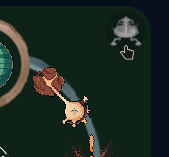

If you leave the system **unlocked**, Quantum Moon can still **change planets when you are not looking**—for example while idle or when another trigger fires. Lock with the scout when you want a stable theme.

### Five planetary stops

Each row is a full desktop (wallpapers + shell) with the **Quantum Moon** panel beside it—the ring and controls you use to pick a world.

#### Timber Hearth

<table>
<tr>
<td width="72%">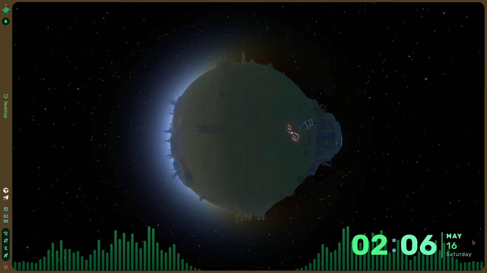</td>
<td width="28%" valign="top">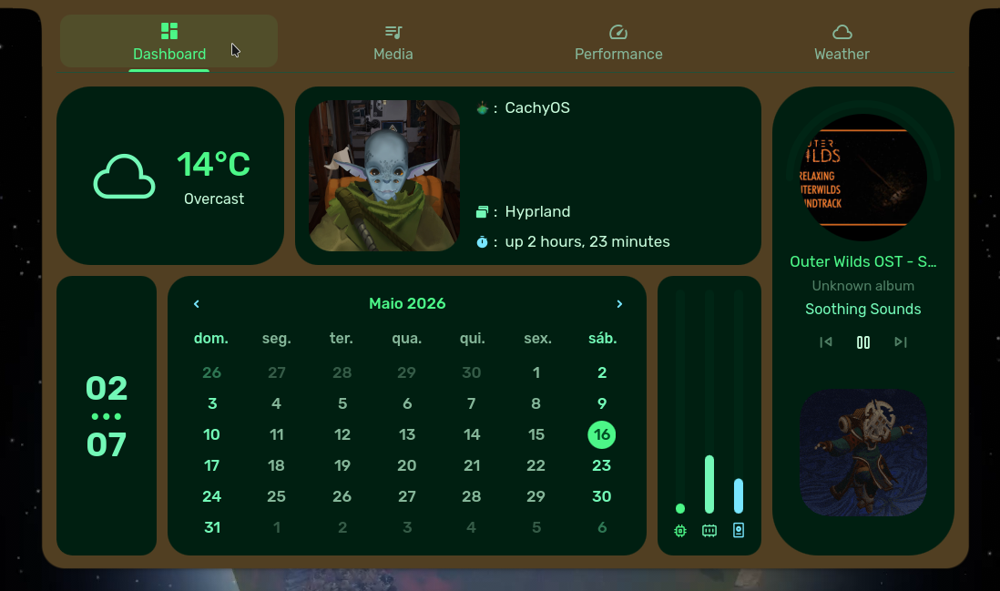</td>
</tr>
</table>

#### Hourglass Twins

<table>
<tr>
<td width="72%">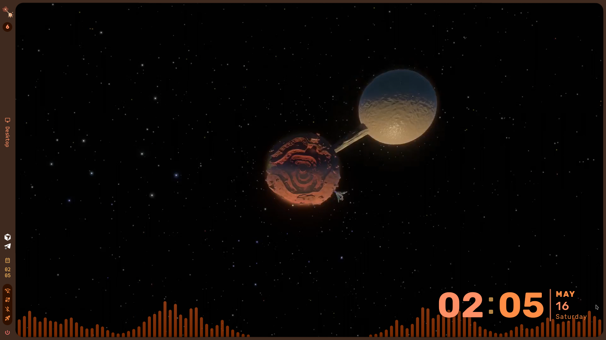</td>
<td width="28%" valign="top">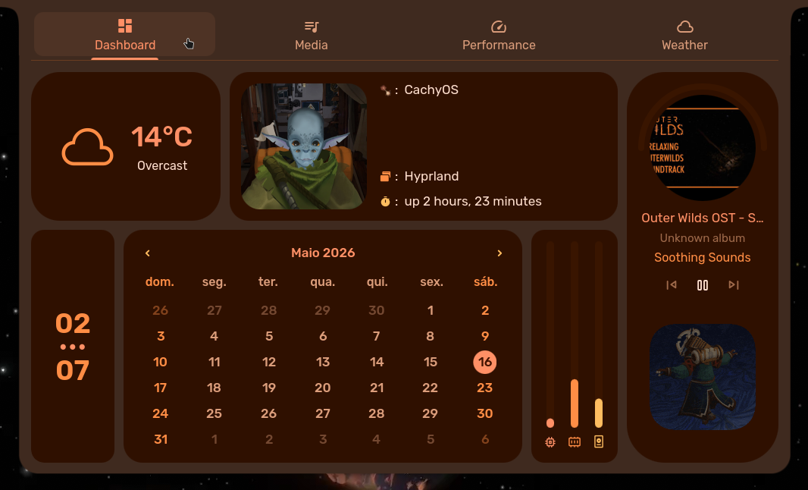</td>
</tr>
</table>

#### Giant's Deep

<table>
<tr>
<td width="72%">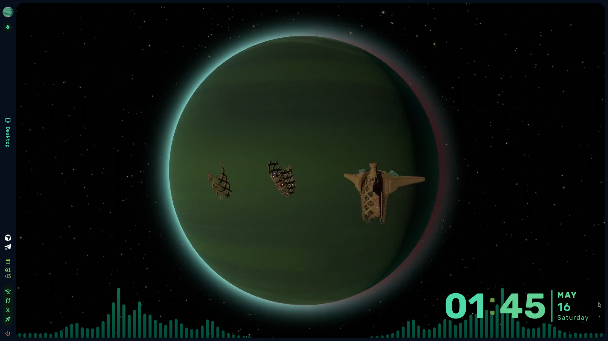</td>
<td width="28%" valign="top">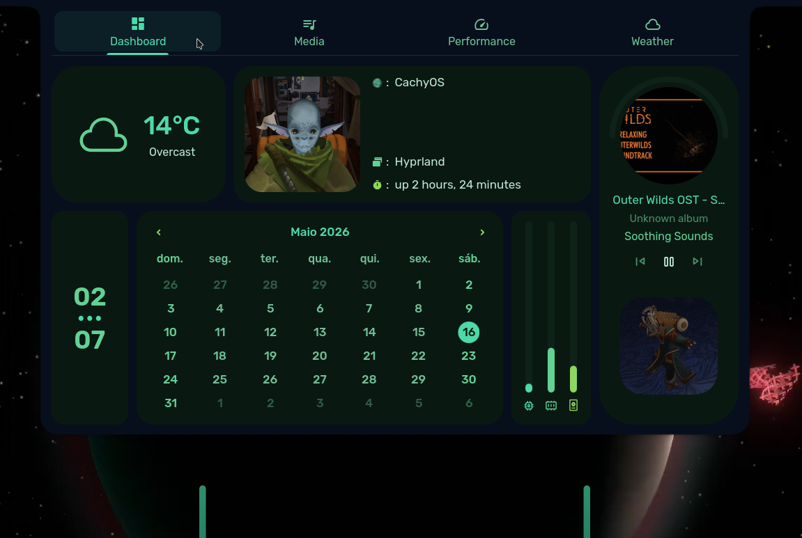</td>
</tr>
</table>

#### Brittle Hollow

<table>
<tr>
<td width="72%">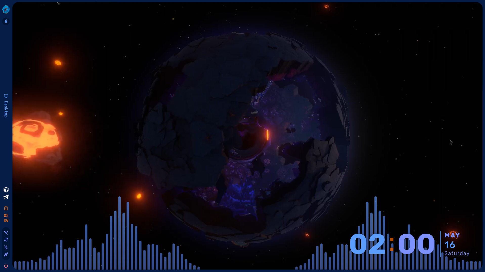</td>
<td width="28%" valign="top">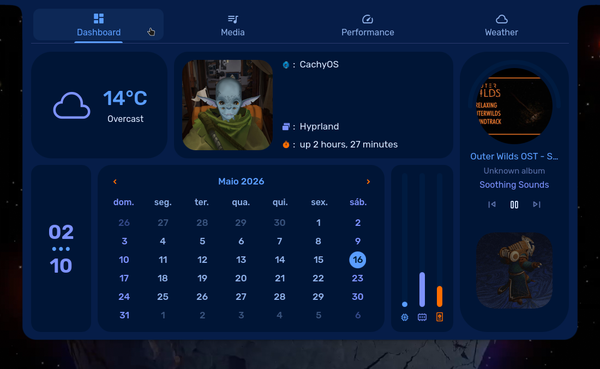</td>
</tr>
</table>

#### Dark Bramble

<table>
<tr>
<td width="72%">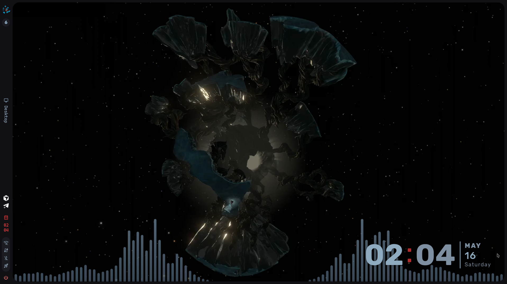</td>
<td width="28%" valign="top">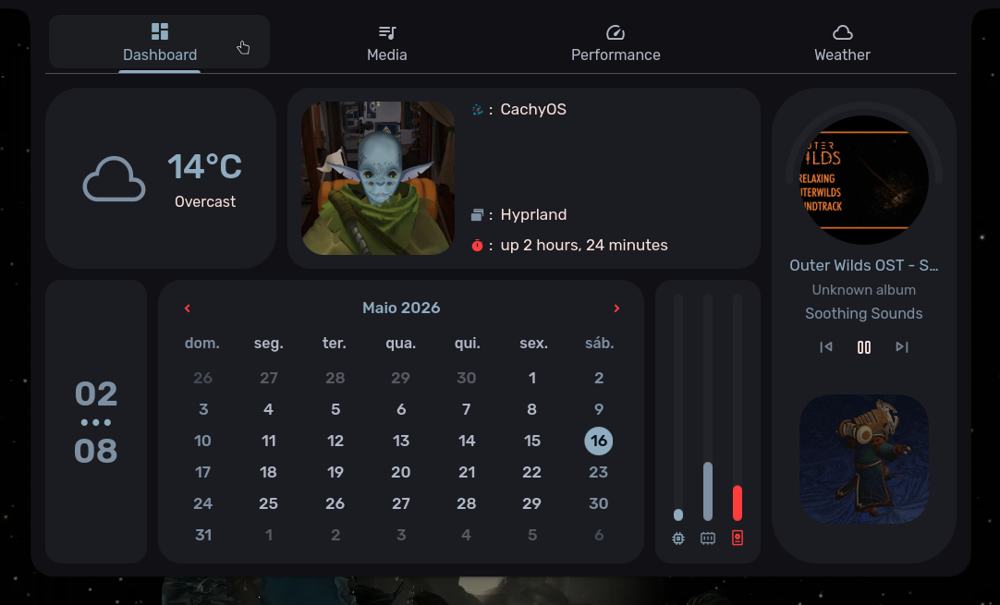</td>
</tr>
</table>

## Install

Follow **[docs/installation-tutorial.md](docs/installation-tutorial.md)** step by step on **Arch Linux / CachyOS** (or another Arch-based distro with Hyprland). It covers cloning from **[github.com/atlazlp/Quantum-Moon](https://github.com/atlazlp/Quantum-Moon)** anywhere under `$HOME`, running `./install-caelestia.sh`, Quantum Moon path registration, MVP assets, Quickshell patches, and first `qm-apply`.

After install: **[docs/post-install-reference.md](docs/post-install-reference.md)** (keyboard/timezone defaults, fewer-than-three monitors, shortcut overview).

## Layout

| Path | Purpose |
|------|---------|
| [`caelestia/`](caelestia/) | `hypr-user.conf`, `hypr-vars.conf`, `shell.json`, `hyprpaper.conf`, `monitors/`, [`assets/`](caelestia/assets/) (logo, GIFs, static hyprpaper crops) |
| [`patches/quickshell-caelestia/`](patches/quickshell-caelestia/) | Quickshell QML overrides |
| [`quantum-moon/`](quantum-moon/) | Mode metadata, palettes, scripts (`qm-apply`, `qm-random`, optional video helpers) |
| [`scripts/`](scripts/) | Installers, patch helper, backup |
| [`extras/`](extras/) | Optional system-level snippets (e.g. keyd) |
| [`docs/readme-screenshots/`](docs/readme-screenshots/) | README preview images (desktops, panels, QM button, scout) |
| [`reference/bar-entries.stock.json`](reference/bar-entries.stock.json) | Stock Caelestia bar order reference |

## Optional scripts (not required for the tutorial)

- **`scripts/install-nautilus-sidebar-bookmarks.sh`** — GTK bookmarks, **`gtk-4.0`** mount splitter CSS, **`gio`** metadata icons (**`~/.config/caelestia/nautilus-drive-icons`**), recent-files **`gsettings`**. Called from **`install-caelestia.sh`** / **`install-caelestia-overlays.sh`**.
- **`scripts/deploy-keyd-mouse-thumb-meta.sh`** — install [`extras/keyd-mouse-thumb-as-meta.conf`](extras/keyd-mouse-thumb-as-meta.conf) for keyd.
- **`scripts/install-caelestia-overlays.sh`** — refresh Caelestia files from Quantum Moon into `$HOME/.config` after backing up to a directory you choose (`CAELESTIA_OVERLAY_BACKUP_ROOT` or default `/mnt/Backup` if present).
- **`scripts/backup-quantum-moon-baseline.sh`** — archive repo + live configs for debugging.

## Credits

- **Author** — [atlazlp](https://github.com/atlazlp) · **[Quantum Moon](https://github.com/atlazlp/Quantum-Moon)**.
- **Planet icons and miniatures** — from [artesracor on Behance](https://www.behance.net/artesracor).
- **Videos** — all pulled from the game using [Cinematic Unity Explorer for Outer Wilds](https://github.com/MegaPiggy/Cinematic-Unity-Explorer-For-Outer-Wilds) and OBS. Higher-quality video is possible but would be heavier.
- **Scout logo** — 3D render using [outer-scout-blender](https://github.com/Picalines/outer-scout-blender).
- **Style and selector ring** — [amayassm](https://amayassm.tumblr.com/) helped me with style decisions and made the selector ring on the Quantum Moon widget.
- **Shell base** — [Caelestia](https://github.com/caelestia-dots/caelestia), an excellent shell and a good base for editing.
- **Compositor** — [Hyprland](https://github.com/hyprwm/Hyprland).

## Licensing

**Original code and configuration** in this repository is licensed under the [MIT License](LICENSE) (see the file for the full text). That license applies only to materials contributed here as **Quantum Moon** originals; it does **not** cover *Outer Wilds* intellectual property, third-party assets bundled for personal theming, or upstream projects—each of those stays under its own terms.

*Outer Wilds* is a trademark of Mobius Digital / Annapurna Interactive. **Quantum Moon** is an independent, fan-made homage and is **not** affiliated with, endorsed by, or sponsored by those rights holders. See also **[docs/installation-tutorial.md](docs/installation-tutorial.md)** §14.
